# DIVINE BATTLES

## Game Description 

Divine Battles is a 3D board game based over the TV teen show Yugi-Oh Duels. 
The main purpose of the game is to decrease opponent's HP to zero. It can be done by attacking opponent's monsters (which represented by their cards), attacking the opponent directly and using spell cards.

#### Characters

The game is represented as a duel between the series' hero - Yami Yugi and his eternal nemesis - Seto Kaiba, Therefore the user is playing as Yami Yugi and the PC is playing as Seto Kaiba.
Yami Yugi: An alternative personality of Yugi Moto and ancient Pharaoh of Egypt. Along the series, as a duel kicks off, Yugi Moto willingly changing his own personality to Yami Yugi,  using his unique Millennium Pyramid necklace, in order to increase his dueling skills by using the power of darkness, which Yami Yugi was trained and skilled at his ancient days as Pharaoh of Egypt.
Seto Kaiba: The proud CEO of Kaiba Corporation, a rich genius high school student. Along the series, Kaiba repeatedly trying to beat Yami Yugi on a duel; which remains an unaccomplished objective until these days. The fact of being defeated over and over again, in addition to his arrogance as a rich and successful man, turned him obsessed with dueling, beating Yami Yugi especially and to prove that he is the almighty king of the game.

Each character has it's own special player power:

* <u>Yami Yugi</u>: "Snowfall of Doom" - using dark magia  to summon thousands of snowflakes and freeze opponent's monsters to their dark doom death.
* <u>Seto Kaiba</u>: "Lightning Force Chaos" - using his power of chaos to summon deadly lightning strikes which destroy every single opponent's spell / trap.

**Yami Yugi**

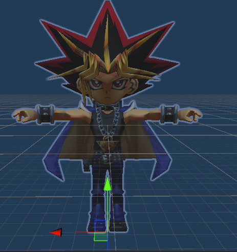

**Seto Kaiba**

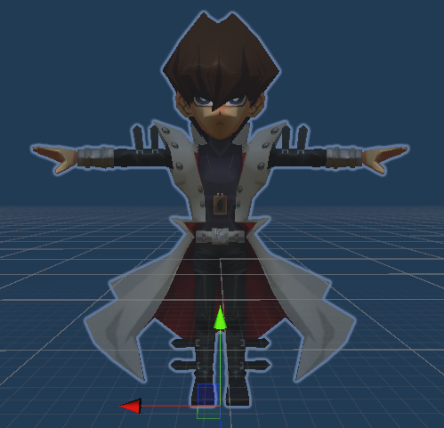

#### Game Structure

The player's arena is divided into four zones:

1. Deck - contains 30 cards; monsters, spells and traps (bottom right object on image).
2. Graveyard - contains all monster cards that done playing after their demise (top right object on image).
3. Spell / Trap - contains 3 spots where the player can activate or set his spells / traps. 
4. Monsters - contains 3 spots where the player can summon or set a monster.

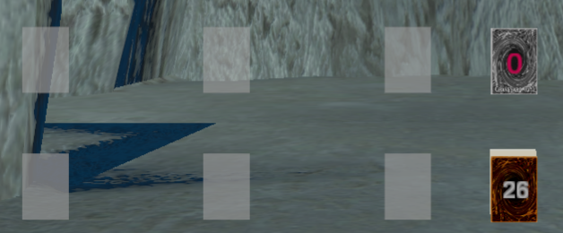

The game starts when each player is drawing four cards from their own deck. After doing so, a random player is chosen to be the first to play. 
Every turn starts with drawing a card from the deck. Afterwards the player is allowed to summon or set only one monster to the field, activate or set as many spells as he wants and setting as many traps as he wants (depends on available spots over the arena).

If a player already has monster cards on the field, he may change their state accordingly:

* From set position (a face down card) - flip summon into face up attack position.

  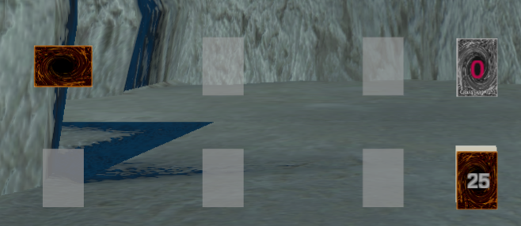
  
* From face-up attack position to face-up defense position.

   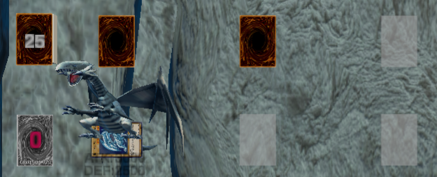
   
* From face-up defense position to face-up attack position.

  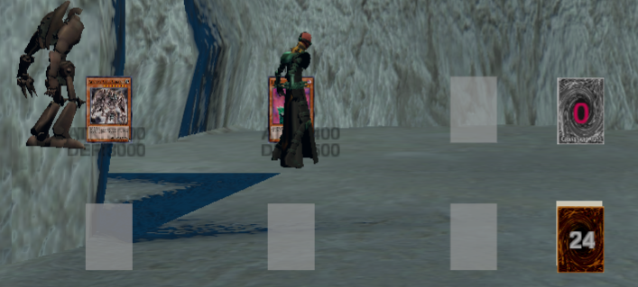

  
  
   

**A player may change a monster's state only once per turn**

If a player has set spell cards on field, he may activate them during his turn if it's possible.

If a player has set trap cards on field, he may activate them as a response to an opponent's action during player's turn or opponent's turn. 

At final phase of the first turn a player cannot commit an attack. Otherwise, at the end of every turn, a player may commit an attack with every monster he has on field, while every monster on field can attack only once - if opponent's monster zone is empty, an attack can be directed towards the opponent himself, else an attack can be directed only towards opponent's monsters.

At any stage of a player's turn, he may use his Player Power. The Player Power can be used only once per duel.

##### Game Purpose

The goal of each player is to decrease his opponent's HP to zero and to win by doing so. A win can also be achieved if the opponent's deck is empty and cannot draw another card. 

#### Cards

##### Monster Cards

A monster card can only be summoned in attack position or set faced down in defense position to the monsters zone. It may perform attacks only in attack position. A monster card contains the following properties:

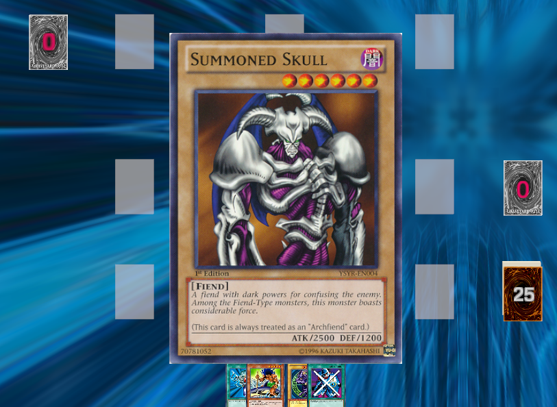

* Name - monster's name.
* Rank - monster's power value (in range of 1 - 12).
* Attribute - monster's basic element - Fire / Light / Dark / Water / Earth
* Type - monster's classification group - Dragon, Spellcaster, Fiend, Reptile, Warrior, Rock, Aqua, Beast, Beast-Warrior, Dinosaur, Fairy, Fish, Insect, Machine, Plant, Pyro, Thunder, Winged Beast, Zombie. 
* ATK Points
* DEF Points
* Description - describes monster's abilities. 

##### Spell Cards

A spell card can only be activated or set on the spells / traps zone, containing the following properties:

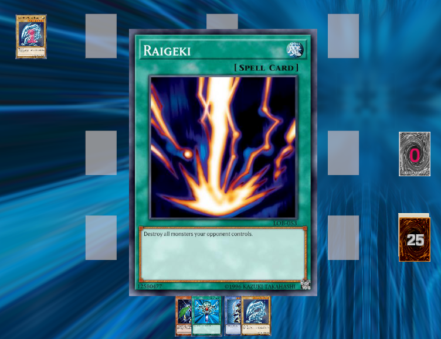

* Name - spell's name.
* Type:
  1. Destroy Monster - destroys a chosen monster on opponent's monsters zone.
  2. Destroy Spell / Trap - destroys a chosen spell / trap on opponent's spells / traps zone.
  3. Change to Attack - changing a chosen defense position opponent's monster to attack position. 
  4. Change to Defense  - changing a chosen attack position opponent's monster to defense position. 
  5. Heal - Increase own HP by given amount.
  6. Direct Attack - Decrease opponent's HP by given amount
  7. Revive - return a chosen monster from the graveyard to your hand.
  8. Draw - draw cards according to a given amount.
* Description - describes the actions for each spell.

##### Trap Cards

A spell card can only be set faced-down on the spells / traps zone and activated as a result of opponent's action. A trap card contains the following properties:

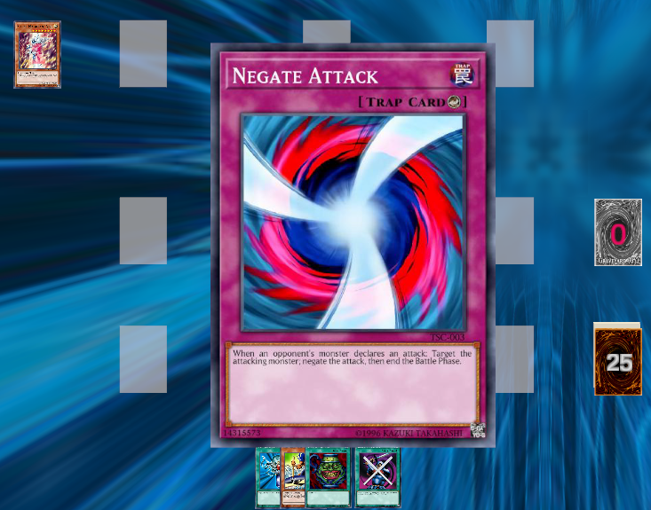

* Name - trap's name.
* Type:
  1. Negate Attack - when opponent's attack is declared, abort it.
* Description - describes the actions for each trap.

## Implementation

The game is managed by a "TurnManager", a script which randomly chooses which player go first then providing 4 cards to each player. Each player is defined on Player class which contains all the visual and logic data about a it. "TurnManager" holds "_whoseTurn" Player public field, that updates at every start of a turn to the current playing player. 
"TurnManager" is a Singleton, therefore at every script on the game we shall know who's playing at the moment and modify its relevant data. Player class also has an otherPlayer public field of type Player which holds the opponent of the a player object and is accessible as well.

Afterwards, the game method is based on a commands queue - every action is basically a "Command"; 
"Command" class holds a static Queue C# data structure which enqueues and dequeues "Command"s created throughout a duel.
The Command class is based on 3 main functions:

1) AddToQueue() - enqueues a command in the commands queue and initiate a new dequeuing commands sequence (which calls the virtual execution function of each command by using polymorphism principles) if it didn't already begin.
2) StartCommandExecution() - virtual function which contains the main purpose of each command - for example, DrawACardCommand's actual drawing will happen in this function. Must end with CommandExecutionComplete()
3) CommandExecutionComplete() - Indicates a command is completed and if the queue is not empty, dequeuing the next command.

Sticking to a Queue method provides us a sync between each player's actions. For example we'll think about this scenario - Player drawing a card, set a spell card on the field, activate a spell card, place a monster card on the field, attack an opponent monster, therefore we'll add their corresponded Commands to the queue - DrawACardCommand, PlayASpellCardCommand, PlayASpellCardCommand, PlayAMonsterCommand, AttackMonsterCommand. By this way we maintain the order of the commands and keep them executing one at a time.

#### Logic VS Visual

Our game is separated to logical classes and its visual representation, each Command connects specific logical class to its corresponded visual representation:

* <u>Logical classes:</u>
  1. CardAsset - Basic common fields to all cards created in the game, helps easily adding as much cards of different types as we want.
  2. MonsterLogic - Keeps all the data of a monster as described on "Monster Cards" paragraph, also provides logical functionalities to each monster - attacking other monster, attacking a player, change field state and die.
  3. SpellTrapLogic - As mentioned above, Spells and Traps are very alike except Traps cards cannot be immediately activated but only as a respond to opponent's action. SpellTrapLogic contains all the data described on "Spell Cards" and "Trap Cards", also provides removal logical function to each trap and spell. Effects themselves are kept in SpellTrapEffect class. 
  4. PlayerPower - Provides logical functionality to each Player special power, as described in Characters section above.

Every logical functionality above calls its corresponded command which activates a visual action on the screen, while calculations are being made on the background.

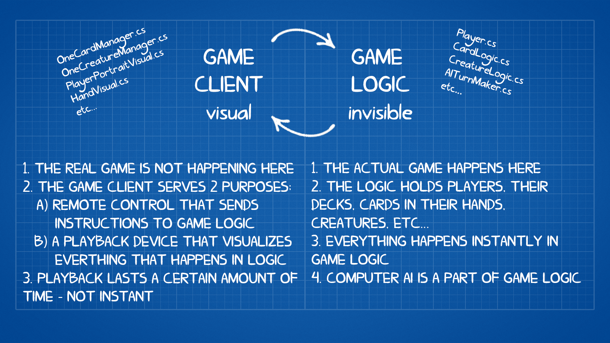

#### AI Opponent System:

The AITurnMaker class is a class that illustrates the opponent's move a his turn. The AI capabilities  include the following functionalities:

* Play a card from hand to the table if possible (according to game rules).
* Use Hero Power - the AI activates his Player Power according to game events. In case of Kaiba, which can destroy all opponent's spells & trap cards in table, activates when the opponent has at least 2 spell / trap cards on table, and didn't use it before.
* Changing Monster's position - the logic works as following:
  1. If there are any set cards on the AI side, and opponent's strongest face-up monster (max ATK) is weaker than a set card, flip summon it.
     Otherwise, remains set.
  2.  If there are any defense position cards on the AI side, and opponent's strongest face-up monster (max ATK) is weaker than a defense position card, change it to attack position.
     Otherwise, remains in defense position.
  3. If there are any attack position cards on the AI side, and opponent's strongest face-up monster (max ATK) is weaker than a attack position card, remains in attack position.
     Otherwise, change it to defense position.
* Activate a set spell on table -  uses every playable spell card on table.
* Activate a trap on table - activates a trap card as a respond to an attack by the opponent.
* Attack with monster on table - if there are any face-up attack position monsters on AI side, each monster will attack the strongest monster that is weaker than it.
  If there are no monsters on the opponent's table side then each available monster will attack directly.

The main (MakeOneAIMove) function of the AI is looping through all functionalities described above; The loop breaks when all of these functionalities has been committed or unavailable to do so (means all functions are returning false) and the turn is ended. 

## Graphics & Visualization

#### Dragging Cards

Divine Battles is a cards game which requires us to support moving cards over the board. Therefore we implemented dragging class which provides the user an ability to move cards on an easy mouse drag and drop.
The implementation is based on updating dragged card transform every frame according to mouse coordinates. Furthermore there is an option to manipulate objects throughout the dragging (like enlarging attacking target arrow according to mouse coordiniates, as seen on the image below). Finally, when dragging is over (card is dropped), we check if dragging was meaningful (like placing a card on the field), otherwise we bring the card back to its original position.

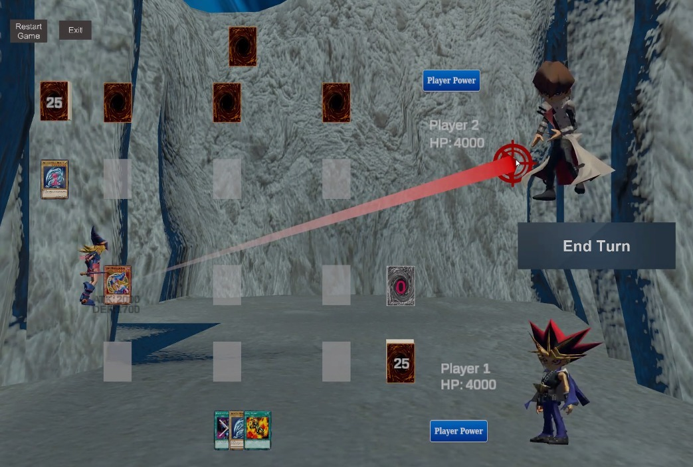

#### Card Preview

We provide the user an option to take a better look at his cards before using it (means while it's on hand)
User may hover over cards on his hand and they'll automatically scale-up to a more clear view of them.

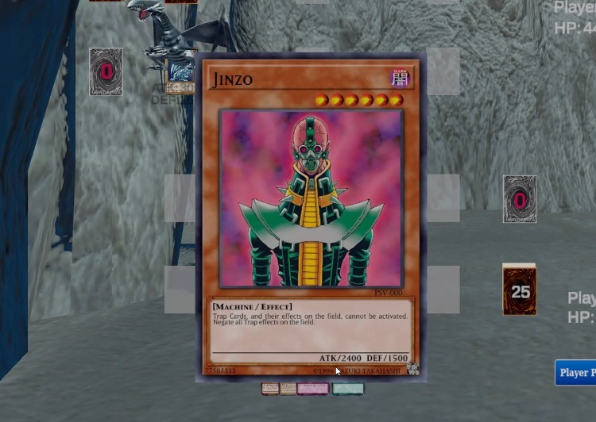

#### Models

In TV series, one of the most familiar feature of dueling is watching monsters hatching out of cards and combat each other.
Therefore, we took this idea and implemented it on Divine Battles; when placing a monster on field, a 3D model of the summoned monster appears above its card. The models are divided to 3 categories, each category has it's own animations (idle, attack, defense state and die):

1. Magicians - Monsters of Spellcaster type, cast spells on targets and using magic while on defense position.

   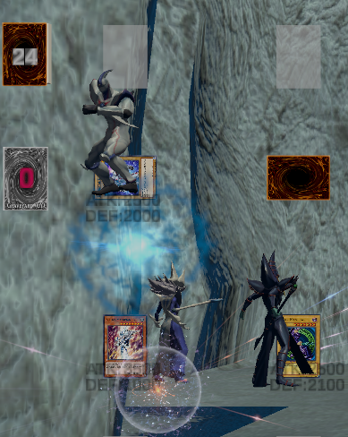

2. Throwers - Monsters of Dark attribute and non-Spellcaster type, using dark magic to throw an explosive orb to blow up their enemies in an huge blast.

   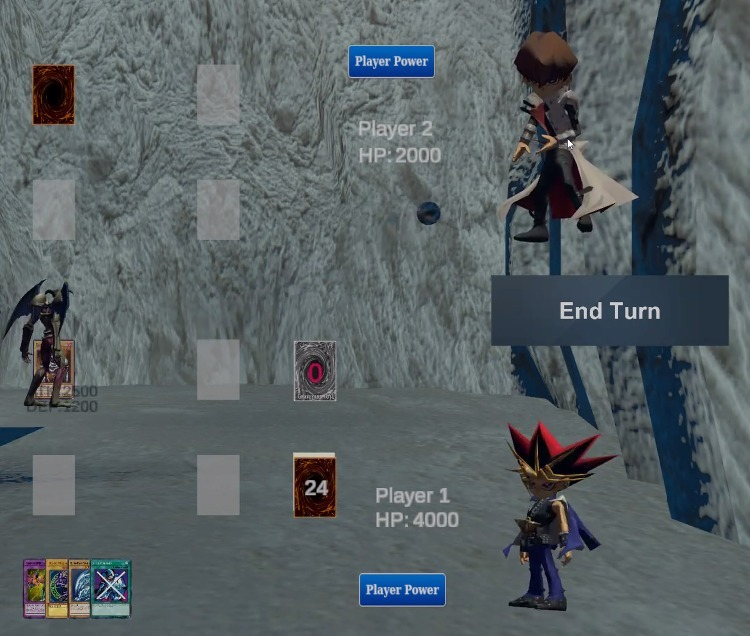

3. Warriors - Non-Dark attribute nor Spellcaster type monsters, using frontal fighting style - pounce on an enemy and brutally attack it using its fists.

   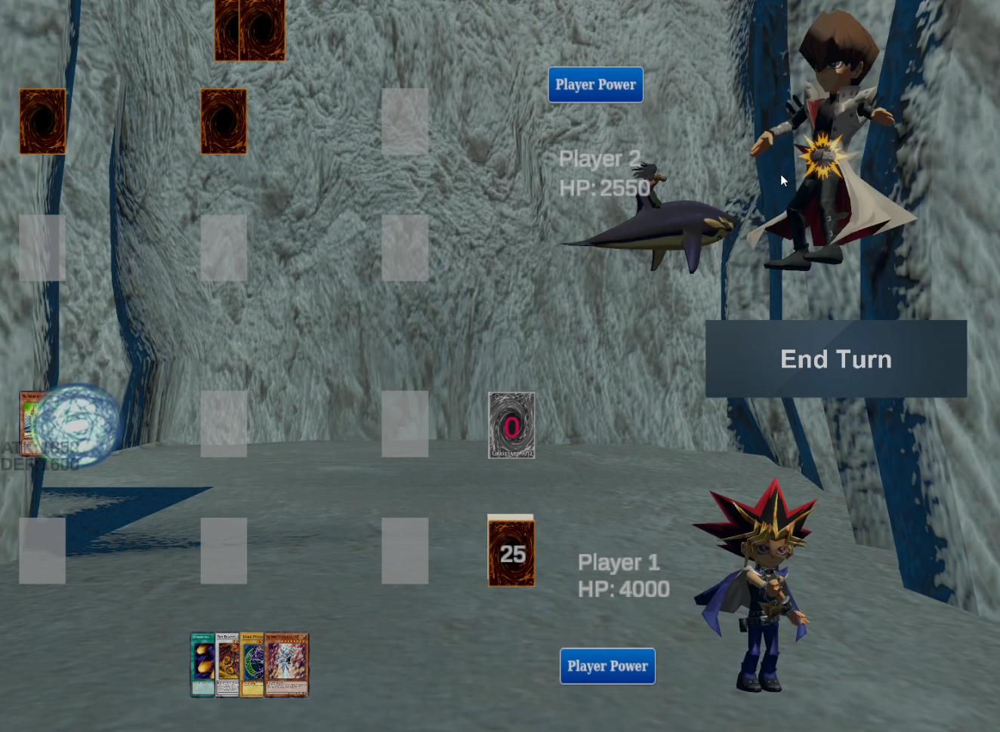

#### Objects Transformations - DOTween

Throughout the game there are many transformations of objects:

* **Translation** - Drawing cards, sending monsters to graveyard, attacking effects, models frontal attacks, AI placing cards.
* **Rotation** - Flipping cards, change cards positions (attack to defense and vice versa)
* **Scale** - Preview of cards on hand, as seen in Card Preview paragraph.

All these actions are implemented using DOTween unity library which provides actual transformations of cards and its visualization, according to selected end spot / angle / size and custom duration of transformation.

### Graphic Visual Effects

#### Particle System

A particle system is a technique in game physics, motion graphics, and computer graphics that uses many minute sprites, 3D models, or other graphic objects to simulate certain kinds of "fuzzy" phenomena, which are otherwise very hard to reproduce with conventional rendering techniques - usually highly chaotic systems, natural phenomena, or processes caused by chemical reactions.
In our project it's reflected by the following: 

1. Activating spell cards:

   * Heal spells

     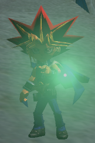

   * Direct Attack spells

     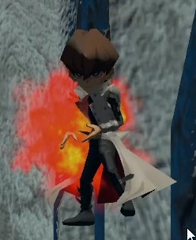

2. Kaiba's Player Power  - "Lightning Force Chaos"  

   ​    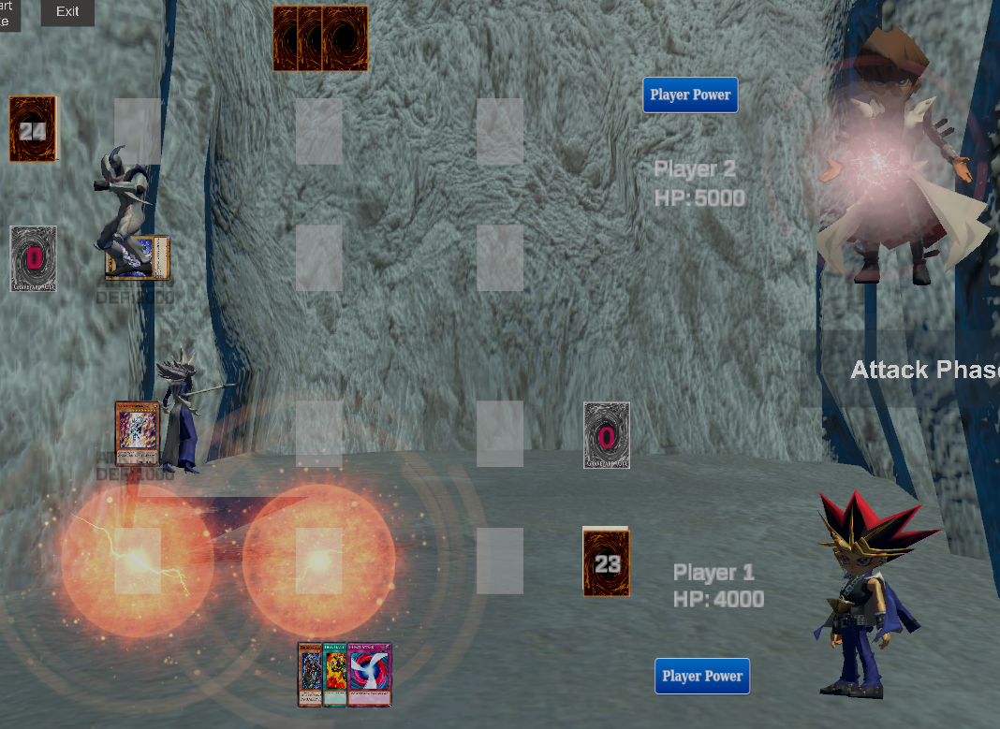

3. Magician's attacks

   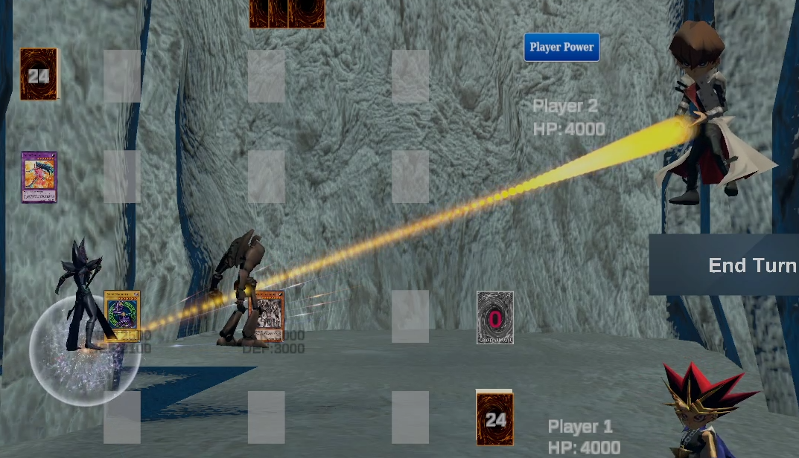

#### Perlin / Simplex Noise

Perlin noise is a procedural texture primitive, a type of gradient noise used by visual effects artists to increase the appearance of realism in computer graphics. The function has a pseudo-random appearance, yet all of its visual details are the same size. This property allows it to be readily controllable; multiple scaled copies of Perlin noise can be inserted into mathematical expressions to create a great variety of procedural textures. 

Simplex noise is a method for constructing an n-dimensional noise function comparable to Perlin noise but with fewer directional artifacts and, in higher dimensions, a lower computational overhead.

In Divine Battles, we used both Perlin and Simplex noise to create the following: 

* Spell / Trap destroy effect by sand storm representation

  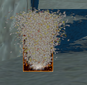

  

* Fire spheres turn to smoke which represents an explosion as a consequence of a Thrower attack  

  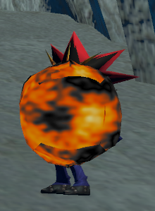

  

  

#### L-System

An L-system is a parallel rewriting system and a type of formal grammar. An L-system consists of an alphabet of symbols that can be used to make strings, a collection of production rules that expand each symbol into some larger string of symbols, an initial "axiom" string from which to begin construction, and **a mechanism for translating the generated strings into geometric structures**.

In Divine Battles we used L-system to create the following:

* Yami Yugi Player Power - "Snowfall of Doom" 
  This Player Power generates a snow storm which contains clouds made of particles and snowflakes made by L-System procedurally - the effect itself forms for 20 seconds, while every 3 seconds the flakes are changing their forms according to L-System formula as defined in code.
  Furthermore, we used directional light to create snow layer effect on each monster model, affected by the storm, as seen below; Every 2 seconds we increase the light intensity to achieve snow piling effect.

  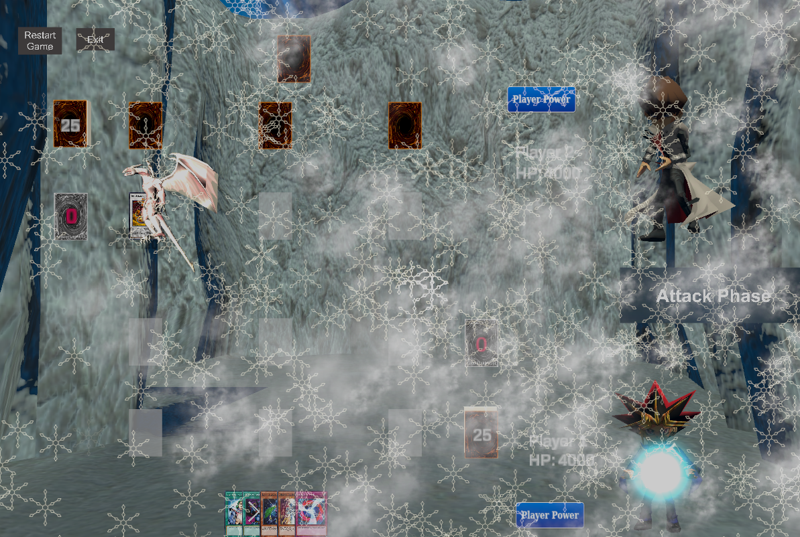

* Destroy Monster spell
  This spell generates lightning effect in order to demonstrate the sudden destruction of a monster on table. The lightning effect is generated procedurally by L-System specific formula that creates lightning strikes in various forms.

  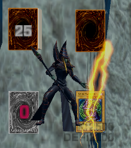
